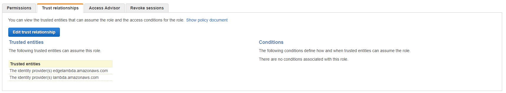
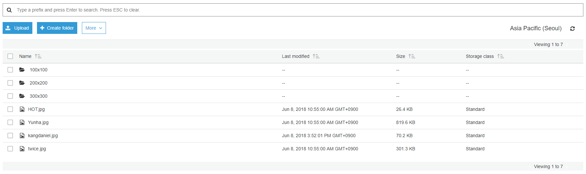

# Lambda@Edge 구성
이제 모든 준비는 끝났다. 패키징된 .zip 파일로 버지니아 지역에 Lambda를 생성하여 배포한 후 CloudFront에서 배포된 Lambda ARN을 이용하여 `Viewer Request`와 `Origin Response`를 설정하면 된다.

그 전에 Lambda에 실행 권한을 생성하고 S3 Bucket의 권한을 수정하는 작업을 거친 후 Lambda@Edge를 구성해 보자

## Lambda Excute IAM Role 생성
1. [Amazon Web Service](https://signin.aws.amazon.com)에 접속하여 로그인 한다.

2. IAM Console로 접속하여 왼쪽 네비게이터에서 **Role**를 클릭한 후 **Create role**를 클릭한다.

3. **Create role**화면이 뜨면 **Select type of trusted entity**는 `AWS service`를, **Choose the service that will use this role**는 `Lambda`를 선택하고 **Next: Permissions**버튼을 클릭한다.

4. **Attach permissions policies**에서는 `AWSLambdaBasicExecutionRole`을 검색하여 체크박스에 체크한 후 **Next: Review**버튼을 클릭한다.

5. **Review**에서 다음과 같이 입력한 후 **Create role**버튼을 클릭한다.
    - `Role name`: Role 이름을 정의한다. 알아보고 구분하기 쉽게 입력한다. 권장은 LambdaEdge{NAME}으로 입력하는 것이다.
    - `Role description`: 생성 할 Role의 설명을 입력한다. 기본 값 그대로 두자.
    - `Trusted entities`: 값이 `AWS service: lambda.amazonaws.com`인지 확인한다.
    - `Policies`: 값이 `AWSLambdaBasicExecutionRole`인지 확인한다.

6. 생성된 Role을 검색하여 클릭한다.

7. 생성된 Role의 **Summary**화면이 나오면, **Trust relationships**탭으로 이동한 후 **Edit trust relationship**버튼을 클릭한다.

8. **Edit Trust Relationship**화면이 뜨면, 다음과 같이 내용을 수정한 후 **Update Trust Policy**버튼을 클릭한다.
    ```trust policy
    {
        "Version": "2012-10-17",
        "Statement": [
            {
            "Effect": "Allow",
            "Principal": {
                "Service": [
                    "lambda.amazonaws.com",
                    "edgelambda.amazonaws.com"
                ]
            },
            "Action": "sts:AssumeRole"
            }
        ]
    }
    ```

9. Trust Policy의 수정이 완료되면, **Trusted entities**에 다음 그림과 같이 표시되어야 한다.


## S3 Bucket Policy 수정
10. S3 Console로 접속하여 앞서 생성한 S3 Bucket을 클릭하여 **Permissions**탭을 클릭한다.

11. 상단에 **Bucket Policy**를 클릭한 후 Policy를 다음과 같이 수정한다.
    ```S3 bucket policy
    {
        "Version": "2008-10-17",
        "Statement": [
            {
                "Sid": "1",
                "Effect": "Allow",
                "Principal": {
                    "AWS": [
                        "arn:aws:iam::cloudfront:user/CloudFront Origin Access Identity {OAI_ID}",
                        "arn:aws:iam::ACCOUNTNUMBER:role/ROLENAME"
                    ]
                },
                "Action": "s3:GetObject",
                "Resource": "arn:aws:s3:::{YOUR_BUCKET_NAME}/*"
            },
            {
                "Sid": "2",
                "Effect": "Allow",
                "Principal": {
                    "AWS": [
                        "arn:aws:iam::cloudfront:user/CloudFront Origin Access Identity {OAI_ID}",
                        "arn:aws:iam::ACCOUNTNUMBER:role/ROLENAME"
                    ]
                },
                "Action": "s3:ListBucket",
                "Resource": "arn:aws:s3:::{YOUR_BUCKET_NAME}"
            },
            {
                "Sid": "3",
                "Effect": "Allow",
                "Principal": {
                    "AWS": "arn:aws:iam::ACCOUNTNUMBER:role/ROLENAME"
                },
                "Action": "s3:PutObject",
                "Resource": "arn:aws:s3:::{YOUR_BUCKET_NAME}/*"
            }
        ]
    }
    ```

## Lambda function 생성과 배포
12. Lambda Console을 N.Virginia 지역으로 접속하여 **Create function**을 클릭하여 `viewer-request-function`을 생성한다.

13. **Create function**화면이 뜨면 다음과 같이 입력한 후 **Create function**버튼을 클릭한다.
    - `Type`: `Author fomr scrach`를 선택한다.
    - `Name`: Lambda function 이름을 입력한다. 중복이 되지 않고 식별할 수 있도록 입력한다.
    - `Runtime`: **Node.js 6.10**을 선택한다.
    - `Role`: **Choose an existing role**을 선택한다.
    - `Existing role`: 앞서 생성한 Role을 선택한다.

14. 생성된 Lambda function의 **Function code**영역에서 **Code entry type**을 `Upload a .ZIP file`로 변경한다.

15. 변경 후 **Function package**에 있는 **Upload**버튼을 클릭하여 다운로드 받은 `viewer-request-function.zip`파일을 선택한다.

16. 작업이 완료되었으면 상단에 **Save**버튼을 클릭하여 Lmabda function을 저장한다.

17. 상단에 **Actions**버튼을 클릭한 후 **Publish new version**을 클릭한 후 **Publish new version from $LATEST**화면이 뜨면 **Version description**에 `1`을 입력한 후 **Publish**버튼을 클릭한다.

18. 상단에 있는 배포된 `viewer-request-function`의 ARN을 복사하여 메모해 둔다.

19. 12~17번을 참고하여 `origin-response-function`도 생성한다. 단, **Basic settings**영역에 Memory영역을 `512`로, **Timeout**값을 `10`으로 변경하자.

20. 상단에 있는 배포된 `origin-response-function`의 ARN도 복사하여 메모해 둔다.

## CloudFront에 Lambda function 연결
21. CloudFront Console로 접속하여 앞서 생성한 Distribution을 클릭한다.

22. **Behaviors**탭으로 이동하여 **Default**정책을 선택한 후 **Edit**버튼을 클릭한다.

23. 제일 아래쪽에 **Lambda Function Associations**옵션에 다음과 같이 입력한 후 **Yes, Edit**버튼을 클릭한다.
    - `Event Type`: Viewer Request
    - `Lambda Function ARN`: 배포된 `viewer-request-function`의 ARN
    - `Event Type`: Origin Response
    - `Lambda Function ARN`: 배포된 `origin-response-function`의 ARN

## dism 확인
24. CloudFront의 Domain Name을 복사하여 다음과 같은 URL을 만든 후 주소창에 입력한다. 그리고 원하는 이미지가 출력되는지 확인 한다.
    ```
    https://{CLOUDFRONT_DOMAIN_NAME}/twice.jpg
    ```

25. 다음과 같이 `d`라는 Query String을 추가하여 조회해 본다.
    ```
    https://{CLOUDFRONT_DOMAIN_NAME}/twice.jpg?d=100x100
    ```

26. S3 Console로 접속하여 생성한 Origin Bucket을 확인하면 다음과 같이 폴더가 어러개 생성 된 것을 확인할 수 있다.
